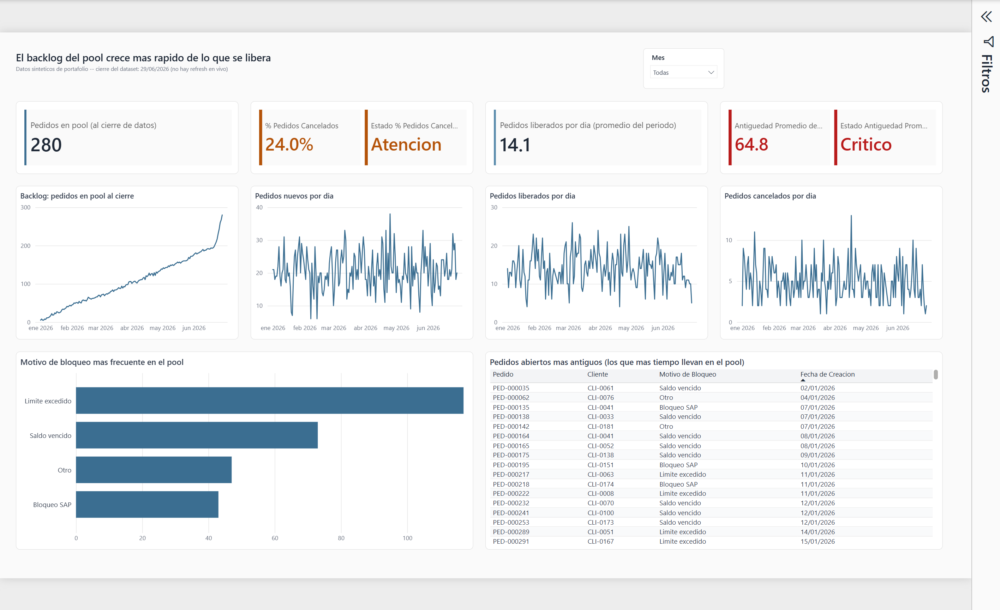
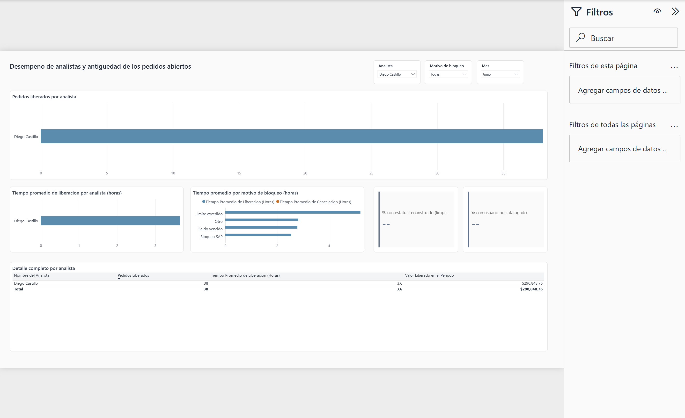

# Order Release Monitoring

Data pipeline and dashboard to monitor a company's credit pool: orders blocked by credit limit, past-due balance, or SAP block, and how fast the credit team releases or cancels them.

This was one of my first SQL and Power BI projects, originally built in SQL Server against a real system at the company I work for. I rebuilt it completely — logic, data model, and report — applying what I've learned since then in later projects (medallion architecture, star schema, DAX).

## Problem and objective

When an order gets blocked for credit reasons, it enters a "pool" until an analyst releases it or it gets canceled. The team needs to know three things at any given moment: how many orders are still stuck, how fast they're being resolved, and whether the backlog is growing or shrinking. Without that, an order can sit in review for weeks without anyone noticing.

## Dataset

The company's real data can't be published, so this repo uses a synthetic generator (`python/generate_source_data.py`) that reproduces the same shape and the same inconsistencies the original data had:

- 3,712 orders over 180 days, 200 customers, 10 credit analysts
- Non-equiprobable block reason (exceeded limit is the most common, as in the real business)
- A batch of orders with `estatus` outside the catalog in the first two weeks (simulates a real capture issue that had to be resolved in Silver, not discarded)
- Inconsistent username format (uppercase, underscore vs. period) to show the real cleaning that the Silver layer does

Fixed seed — running the generator twice produces exactly the same data.

## Architecture

```
Python (synthetic data)
        │
        ▼
Bronze (DuckDB, everything VARCHAR, nothing cleaned)
        │
        ▼
Silver (typed, status reconstructed, one record per order)
        │
        ▼
Gold (star schema: 5 dimensions + 2 fact tables)
        │
        ▼
Power BI (semantic model + 2 report pages)
```

## Why DuckDB and not SQL Server

The original version ran against SQL Server with a linked server to MariaDB — faithful to the company's real environment, but impossible for anyone reviewing the repo to clone and run. DuckDB needs no installation or infrastructure, runs locally from a single file, and its SQL syntax is close enough to T-SQL that the business logic translated almost directly. For this project's volume (a few thousand rows) there's no reason for anything heavier.

## Pipeline and technical decisions

**Bronze:** the three source tables (`pedidos_pool_clientes`, `estatus_pool`, `vendedores`) are loaded as-is, everything as text. Bronze doesn't decide types or fix anything — if something arrives malformed from the source, it should still look malformed here. That discipline is what lets Silver have real, verifiable work to do.

**Silver:** here I fixed two things that were poorly resolved in the original version:

- The `estatus` coming from the source is sometimes invalid (outside the catalog). The original version simply filtered those dates out at extraction (`WHERE creado_en >= '...'`), losing those orders forever. The new version reconstructs the status from the release/cancellation dates, which are more reliable data than a poorly captured categorical field, and flags which ones were reconstructed (`estatus_fue_reconstruido`) instead of hiding it.
- The original logic used `IFNULL(v.nombre, 'Sistema')`, which mixed two completely different cases under the same label: an order that **hasn't been released yet** and an order released by **someone not in the analyst catalog**. Now these are two separate fields (`nombre_analista` null vs. `usuario_no_catalogado` = true), and the second is exposed as a data-quality measure on the dashboard instead of being hidden.

**Gold:** the biggest change was replacing the original design's TRUNCATE + INSERT. That pattern overwrote the entire table on every load — it worked for seeing the pool's *current* state, but made it impossible to see how it had evolved. The solution was to split two distinct grains into two fact tables:

- `fact_pedido_pool` — one record per order (the direct equivalent of the original design, but as a star-schema fact).
- `fact_pool_snapshot_diario` — one record per day with the state of the pool as it looked that day (new orders, released, canceled, and how many were still open at close). This is the table that solves the history problem: in production it would run once a day, appending "today's" row (INSERT, never TRUNCATE).

## Data quality

Two dashboard measures exist specifically to expose, not hide, the data's limits:

- **% of orders with reconstructed status** (~1.2%): how many records arrived with an invalid code and were reconstructed from dates.
- **% of orders with an uncataloged user**: how many orders were released by someone who doesn't appear in the analyst catalog (0% in this synthetic dataset, but the measure is ready for when it shows up in real data).

## Data model (Gold)

Star schema with two facts and a shared (conformed) calendar dimension between both:

```
        dim_cliente ─┐
      dim_analista ──┤
   dim_motivo_pool ──┼── fact_pedido_pool ──┐
       dim_estatus ──┘                       │
                                              ├── dim_calendario
                        fact_pool_snapshot_diario
```

`fact_pedido_pool` has three date keys into `dim_calendario` (creation, release, cancellation) as a role-playing dimension — the creation one stays active by default, the other two are activated on demand in a couple of measures via `USERELATIONSHIP` when we need to see "released in the period" instead of "created in the period."

## KPIs and business questions

| Question | KPI / measure |
|---|---|
| How many orders are still stuck right now? | Orders in Pool at Close |
| Is the backlog growing or shrinking? | Daily trend (time line) |
| What proportion ends up canceled instead of released? | % Canceled Orders (with traffic light) |
| How old are the orders that are still unresolved? | Average Pool Age (with traffic light) |
| What's the most frequent block reason? | Block Reason (breakdown) |
| How well is each analyst performing? | Orders Released and Average Release Time by Analyst |
| How reliable is the data? | % Reconstructed Status, % Uncataloged User |

## Dashboard

**Page 1 — Pool status.** Designed for an at-a-glance review: 4 KPI cards (two with a green/amber/red traffic light over real thresholds, two neutral), four trend lines synced on the same date axis, the breakdown by block reason, and a table with the longest-open orders — worst first, like an attention queue.



**Page 2 — Analysts and age.** Analysis view: ranking of orders released by analyst, average release time, time comparison by block reason, and the two data-quality measures. With Analyst, Reason, and Month slicers.



The **Month** slicers are synced between the two pages (choosing a month on one applies to the other). The Analyst and Reason ones only live on page 2 on purpose: on page 1, those two dimensions don't apply to the open pool because **an order that's still open doesn't have an analyst assigned yet** — that's not a limitation of the report, it's a fact of the business (the analyst is only assigned when the order is released).

## Real bugs I found building this

Documenting them here because the process of finding them was more instructive than the final result:

1. **A measure and a column with the same name.** I had a measure `Pedidos en Pool al Cierre` and a hidden column with the same name except for case, in the same table. Power BI doesn't distinguish case for this, and the model refused to load. Fixed by renaming the source column so it doesn't collide.
2. **A mislabeled KPI.** A card said "orders released per day" but it was actually summing the whole selected period, not a daily average — two very different things. Had to build a real average measure (`AVERAGEX` over the calendar) instead of just changing the label.
3. **A table that wouldn't render.** A visual failed with a generic "capacity or license issue." I isolated it by testing 3 different configurations (with filter, without filter, changing the sort field) until confirming the only constant was a measure with a nested `CALCULATE(MAX(...), REMOVEFILTERS(...))` -- Power BI Desktop didn't resolve it well inside that particular table. Fixed by pulling that measure out of the table and using a plain column instead.

## How to reproduce this project

```bash
# 1. Generate the synthetic data (same seed = same data)
python python/generate_source_data.py

# 2. Run the bronze -> silver -> gold pipeline in DuckDB
python python/build_database.py bronze silver gold

# 3. Regenerate the Power BI report (PBIP): pages, visuals, and theme
node powerbi/build_report.js

# 4. Open powerbi/PoolCredito.pbip in Power BI Desktop
```

The semantic model (`powerbi/PoolCredito.SemanticModel/`) is already built and doesn't need step 3 to work — that step only regenerates the report pages. The model's `.tmdl` files can be edited directly or rebuilt with Power BI's modeling tools.

## Limitations and next steps

- The real credit pool almost certainly has escalation rules (who can release what amount) that this synthetic dataset doesn't model.
- Given more time, I'd add a day×reason fact table in Gold so the reason slicers also filter the balance cards on page 1 (today only Month does) — reason does apply to an open order, unlike analyst.
- The refresh is manual (Import mode) because this is a portfolio project with synthetic data, not a production pipeline. In a real environment, `sql/gold/03_gold_fact_pool_snapshot_diario.sql` is exactly the logic that would run once a day.

## Tools used

- **DuckDB** — transformation engine, no need to install a database server to run the project.
- **Python (pandas, numpy)** — reproducible synthetic data generation.
- **Power BI (PBIR/PBIP)** — semantic model and dashboard. The report is generated with a Node.js script (`powerbi/build_report.js`) that translates the design into the project files — so the whole report is reproducible from code, just like the rest of the pipeline.
